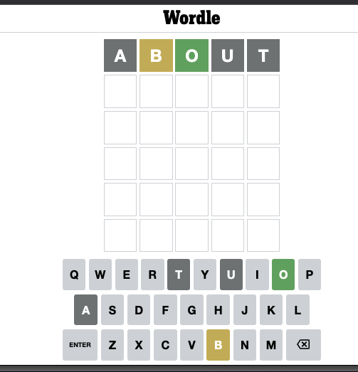
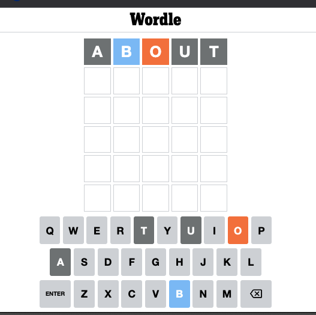
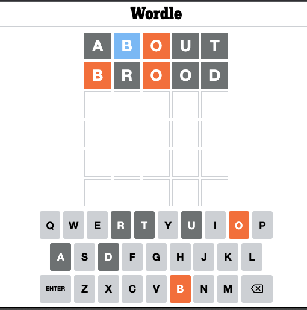
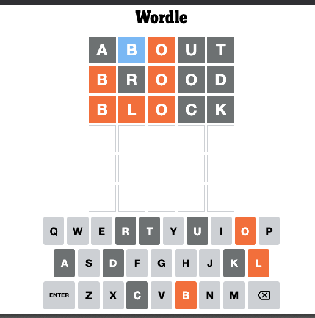
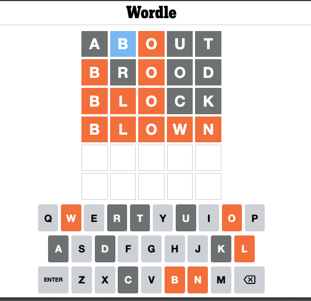

# Wordle 

Most of you probably know what Wordle is - it's a word game where the goal is to guess a five-letter word based on clues you get back for each guess. The clues tell you which letters from your guess are actually in the target word, and of those, which of them are positioned correctly.  So, for instance, if you guess `ABOUT` and the game gives you back the following coloring, that tells you that the answer has an `O` in it in the third position and a `B` in it not in the second position.

Now, if you're like me and find this color scheme hard to parse, you'll be happy to know that Wordle comes with a High Contrast mode you can enable in the settings dialog and that makes it, at least for me, much easier to read.  Here's that guess colored in High Contrast mode.  (I'm going to use High Contrast mode for the rest of these slides.)

Okay, so we are looking for a five letter word with an `O` in the middle and a `B` somewhere else in it, not in the second position. Also, we know that `A`, `U` and `T` aren't in the solution.  So how about... `BROOD`?

This is an improvement, now both the `B` and the `O` are in the right place.  And we've eliminated `R`, `D` and a second `O` from the possibilities.  So a word that looks like `B-O--`.  How about `BLOCK`?

Feels like we're really getting warm.  `BLO--` ... can't be many words like that.  Can't be `BLOOD` because we've ruled out `D` and the second `O`.  Can't be `BLOAT` because we've ruled out `A` and `T`.  How about... `BLOWN`?

